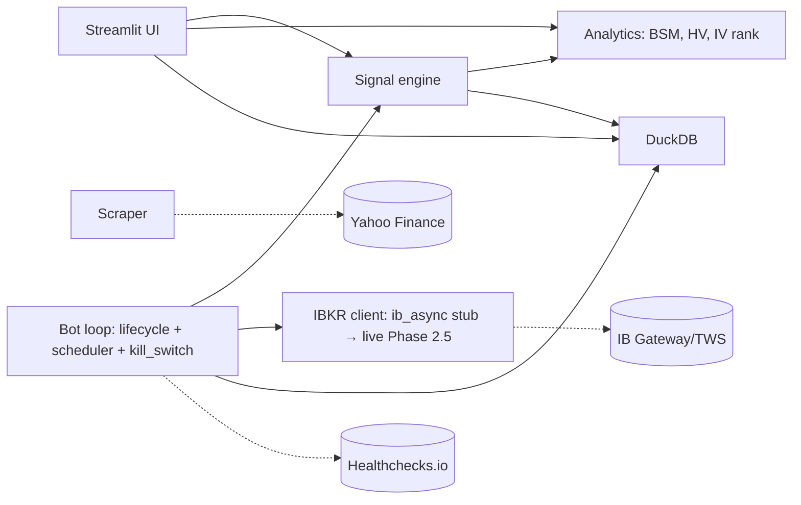

# ◈ VolScope

> Volatility Intelligence Platform for retail options traders — a research
> dashboard evolving into a production-grade autonomous IV mean-reversion
> options bot.

[](https://github.com/SchoenTom/volscope/actions/workflows/ci.yml)


## What VolScope does today

- **IV analysis** — own Black-Scholes-Merton solver (price + 5 Greeks),
  Newton-Raphson IV solver validated against `py_vollib` to 1e-15.
- **Four HV estimators** — close-to-close, Parkinson, Garman-Klass,
  Yang-Zhang.
- **IV rank / percentile / regime** + IV-HV spread analytics.
- **Bidirectional signal engine** — composite-score ranker over
  IVR / IVP / IV-HV / term-slope / 25Δ-RR / HV-momentum / HMM regime.
- **Bot Dashboard** (read-only) — portfolio Greeks, regime gauge,
  ranked signals, open trades, equity curve.
- **Options Lab** — payoff diagrams, Greeks surface, scenario matrix,
  time decay, 11 strategy templates.
- **LEAPS Lab v3** — convergence scanner with deep-OTM dossier renderer.
- **Bot scaffolds** (Phase 2) — state machine, scheduler, kill switch.
  Paper-only; live IBKR wiring is Phase 2.5.

## Quick start

```bash
git clone <your-fork> volscope && cd volscope
uv sync --all-extras
cp .env.example .env                   # fill in IBKR / Finnhub / Telegram keys
uv run pre-commit install
make quickstart                        # seeds 8 tickers + launches Streamlit
```

Open http://localhost:8501.

## Architecture



See [`docs/ARCHITECTURE.md`](docs/ARCHITECTURE.md) for the full module
map + data flow + WORM audit-log invariant.

## Status

| Phase | State |
|---|---|
| 0 — Stabilise | ✅ DONE |
| 1 — Signal engine | ✅ DONE |
| 2 — Paper loop | 🔧 SCAFFOLD shipped, live wiring planned |
| 3 — Backtest validation | ⏳ Planned |
| 4 — Go-live ramp | ⏳ Planned |
| 5+ — Advanced | ⏳ Future |

See [`ROADMAP.md`](ROADMAP.md) for the full phase table and exit gates.

## What this is NOT

- **Not a live trading bot today.** Phase 2 ships scaffolds; live IBKR
  orders require Phase 2.5 paper validation + explicit operator
  approval.
- **Not financial advice.** Every signal is research output. The
  operator is responsible for trade decisions.
- **Not multi-tenant.** Single-operator embedded DuckDB.

## Citations

VolScope's design rests on the following research:

- Castillo & Mira-McWilliams (2026). *FinTech* 5(1), 26 — IV
  mean-reversion universe.
- López de Prado (2018). *Advances in Financial Machine Learning* —
  CPCV, HMM regime detection.
- tastytrade Market Measures — 21-DTE mechanical close (gamma study),
  50% PT (4,872 SPY trades, 2005-2019).
- Bali et al. (2008) — Volatility Risk Premium magnitudes.
- Hull (2018). *Options, Futures, and Other Derivatives*, 10th ed. —
  Black-Scholes worked examples (validation goldens).
- Yang & Zhang (2000) — drift-independent HV estimator.

Each load-bearing decision has an ADR in [`docs/adr/`](docs/adr/).

## Contributing

See [`CONTRIBUTING.md`](CONTRIBUTING.md). TL;DR: Conventional Commits,
PRs only (no direct main pushes), pre-commit hooks required, 65%
coverage gate.

## Security

See [`SECURITY.md`](SECURITY.md). Vulnerability reports → repo owner
directly (no public issue).

## License

Proprietary — see [`NOTICE`](NOTICE). Will flip to MIT when
[`docs/GOING_PUBLIC_CHECKLIST.md`](docs/GOING_PUBLIC_CHECKLIST.md)
gates clear.

## For agents

Reading this in a Claude Code session? Start with
[`WELCOME-AGENT.md`](WELCOME-AGENT.md), then
[`CLAUDE.md`](CLAUDE.md), then
[`memory/INDEX.md`](memory/INDEX.md).
