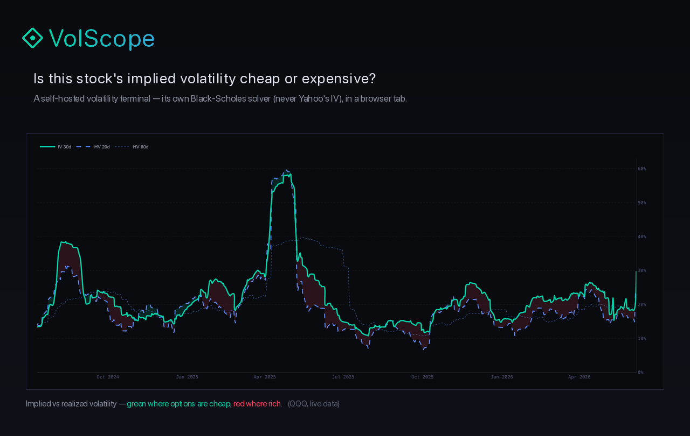

<div align="center">

# ◈ VolScope

### Is this stock's implied volatility cheap or expensive?



[](https://github.com/SchoenTom/volscope/actions/workflows/ci.yml)
&nbsp;
&nbsp;[](LICENSE)
&nbsp;

</div>

**VolScope is a self-hosted volatility research terminal.** Type any ticker and
the chart above answers one question at a glance — *is the option market pricing
more movement than the stock has actually delivered?* Around it sits the context
a vol desk reads: IV rank, a volatility cone, a time-travelling term structure,
25Δ skew, and a one-line plain-English verdict — all computed by VolScope's
**own** Black-Scholes solver, **never** Yahoo's IV. The volatility screen you'd
otherwise rent from Bloomberg, running in a browser tab on your own machine.

> **▶ Get started:** download the ZIP → one quick one-time setup → then it's just a double-click on the **VolScope** icon. [How ↓](#-run-volscope)

## Why VolScope

A retail options trader's single hardest question — *is this option cheap
or expensive right now?* — normally takes a Bloomberg terminal or a pile of
spreadsheets. VolScope answers it in one glance, for any ticker, on your own
machine. What makes it strong:

- **🧮 Its own math, not Yahoo's.** Every implied vol is recomputed from the
  bid/ask mid with VolScope's Black-Scholes-Merton Newton-Raphson solver —
  never Yahoo's opaque, rate-limited IV column. Historical vol is
  Yang-Zhang (drift-independent, gap-aware). The numbers are yours and they
  are honest.
- **📊 The views a vol desk actually reads.** IV rank & percentile (with a
  spike-contamination guard), a **volatility cone** across horizons, a
  **term structure that time-travels** (−7d/−30d ghost curves show shift vs
  twist vs flatten), 25Δ skew with its own percentile rank, regime-shaded
  IV history, and expected-move cards — IV-implied vs HV-implied.
- **🗣️ It speaks plain English.** A one-line verdict sits above the fold on
  every ticker: *"AAPL IV is in the 12th percentile — historically cheap;
  earnings in 9 days."* No jargon decoding required.
- **⚡ Fast and self-hosted.** Embedded DuckDB + Streamlit, sub-second
  navigation after the first load. No account, no subscription, no data
  leaving your machine.
- **🔬 Rigorous by construction.** Put-call parity holds to 1e-6, every
  estimator is property-tested, and analytics never crash the UI — bad
  input returns nothing, not an exception.

## ▶ Run VolScope

Download the ZIP from GitHub and unzip it — you'll get a `volscope-…` folder
with a **VolScope** app icon inside. It runs in two small steps: a one-time
setup, then a double-click forever after.

> **Why a one-time step?** macOS strips the "this file may run" flag from
> anything downloaded as a ZIP (a built-in security default — nothing to do with
> VolScope). So the **first** launch goes through Terminal once to install
> VolScope's private environment. That same step re-enables the flag, so from
> then on the **`VolScope.app`** icon opens with a normal double-click.

### ① First launch — once (~2 min)

1. **Download & unzip.** On the [repo page](https://github.com/SchoenTom/volscope): **Code ▸ Download ZIP**, then double-click the downloaded ZIP to unzip it.
2. **Open Terminal.** Press **⌘ + Space**, type `Terminal`, press **Enter**.
3. In the Terminal window type **`bash `** (the word *bash* followed by one space) — then **drag the `Start VolScope.command` file** from the unzipped folder onto the Terminal window. Its full location fills in for you.
4. Press **Enter**. VolScope installs its environment, fetches a starter
   universe, and opens. ☕ (~2 minutes — only this first time.)

### ② Every time after that

Just **double-click `VolScope.app`** 🟢 — it opens in its own clean window in a
couple of seconds. Quit it like any app (**Dock → Quit**) to stop the local server.

> *Requires **Python 3.11+** on your Mac (free from [python.org](https://www.python.org/downloads/)). VolScope builds its own isolated environment and never touches your system Python. Everything runs locally — no account, no subscription, no data ever leaves your machine.*

<details>
<summary><b>Developer / command-line setup</b></summary>

macOS / Linux, Python 3.11+:

```bash
git clone https://github.com/SchoenTom/volscope.git && cd volscope
python3 -m venv .venv && source .venv/bin/activate
make quickstart
```

`make quickstart` is self-contained: installs every dependency, seeds a
starter universe (SPY + QQQ), and opens the app at <http://localhost:8501>.
Bigger seeds: `make quickstart-bot` (~75), `make seed-broad` (~280),
`make quickstart-full` (~842). Daily afterwards: `make start` (refresh +
launch) or `make run` (launch on existing data).

</details>

## What the UI gives you

**RESEARCH**

- **Discover** — universe-wide opportunity ranker: which names have the
  cheapest / richest IV right now, plus today's biggest movers and crowded
  extremes.
- **Scope** — the hero single-ticker view: a one-line plain-English verdict,
  IV vs HV, full term structure (with −7d/−30d ghost curves), a volatility
  cone, 25Δ skew, 52-week IV range, and regime-shaded history.
- **Heatmap** — sector × IV-percentile treemap of the whole universe.
- **Earnings Hub** — weekly grid of implied moves, crowdedness, and
  IV-crush calibration around earnings.
- **Vol Insights** — skew-adjusted expected move, front/back IV
  decomposition, OI heatmap with max-pain.
- **Scanner** — filter the universe by IV rank / percentile / spread.
- **Alerts** — watchlist-scoped or universe-wide threshold trips
  (anomaly, flow, regime, earnings).

**MANAGE**

- **Watchlist** — TradingView-style groupings, live spot + 1-day %Δ,
  per-list alarm configuration.
- **Command** — a market-overview dashboard plus a manual trade journal
  ("was vol cheap when I entered?").
- **Options Lab** — BSM-priced payoff + Greeks surfaces, scenario matrix,
  time decay, probability cone, IV-slider driven.

## How it works

```
yfinance / FRED ──► daily scrape ──► DuckDB ──► analytics ──► Streamlit UI
(prices, chains,    (own BSM IV       (embedded,   (BSM, Yang-Zhang,   (10 focused
 risk-free rate)     per strike)       local)       cones, regime)      research views)
```

A single daily scrape recomputes IV from option-chain mids with VolScope's
own solver and writes a tidy snapshot to an embedded DuckDB. Every page
reads from that DB and the shared analytics layer — one BSM solver, one HV
estimator, one source of truth, all running locally.

## Built on standard literature

VolScope's analytics rest on published, citable methods — and ship with
golden-master tests that pin them to the textbook values:

- Hull (2018), *Options, Futures, and Other Derivatives* — Black-Scholes
  worked examples (validation goldens).
- Yang & Zhang (2000) — drift-independent historical-vol estimator.
- Bali et al. (2008) — volatility-risk-premium magnitudes.
- tastytrade Market Measures — IV-rank / percentile decision thresholds.

## Contributing & License

PRs welcome — Conventional Commits, pre-commit hooks, tests green
(`make pre-merge-check`). See [`CONTRIBUTING.md`](CONTRIBUTING.md).

MIT — see [`LICENSE`](LICENSE). VolScope is research / educational software:
it computes and visualises volatility and is not investment advice.
