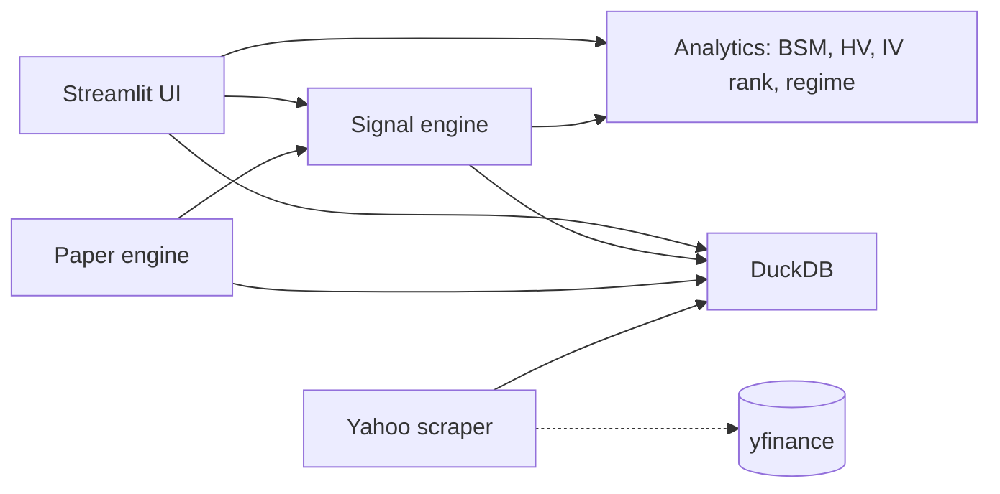

# ◈ VolScope

> ### Is this stock's implied volatility cheap or expensive?
>
> VolScope answers above the fold. Type any ticker and get **one instant
> verdict** on its options — backed by its own Black-Scholes-Merton + IV
> solver (**never** Yahoo's IV), Yang-Zhang realized vol, a volatility
> cone, a time-travelling term structure, regime-shaded IV history, and a
> plain-English read. The volatility screen a retail trader would otherwise
> rent from Bloomberg — self-hosted, in a browser tab.

[](https://github.com/SchoenTom/volscope/actions/workflows/ci.yml)

[](LICENSE)


> [!IMPORTANT]
> **Research / educational software.** VolScope computes and visualises
> volatility — it does not place orders, connect to a broker, or give
> investment advice, and its outputs are not a recommendation. See the
> disclaimer in [`LICENSE`](LICENSE).

## Quick Start

macOS / Linux, Python 3.11+. Three lines — the last one does everything:

```bash
git clone https://github.com/SchoenTom/volscope.git && cd volscope
python3 -m venv .venv && source .venv/bin/activate
make quickstart
```

`make quickstart` is **self-contained**: it installs every dependency,
creates a read-only `.env` (API keys are optional), seeds a 2-ticker
starter universe (SPY + QQQ, or your existing watchlist), and opens the
app at <http://localhost:8501>. Grow the universe from the sidebar's
add-ticker form or **Watchlist → 📥 Import** (paste a TradingView export).

Bigger initial seeds:

| Target | Tickers | Time |
|---|---|---|
| `make quickstart` (default) | SPY + QQQ, or your watchlist | ~2 min |
| `make quickstart-bot` | ~75 | ~4 min |
| `make seed-broad` | ~280 | ~10 min |
| `make quickstart-full` | ~842 | ~30-45 min |

Daily afterwards: `make start` (refresh today's data + launch) or just
`make run` (launch on existing data).

## What the UI gives you

**RESEARCH**

- **Discover** — universe-wide opportunity ranker: which names have the
  cheapest / richest IV right now.
- **Scope** — the hero single-ticker view: a one-line plain-English
  verdict, IV vs HV, full term structure (with −7d/−30d ghost curves),
  a volatility cone, 25Δ skew, 52-week IV range, and regime-shaded history.
- **Heatmap** — sector × IV-percentile treemap of the whole universe.
- **Earnings Hub** — weekly grid of implied moves, crowdedness, and
  IV-crush calibration around earnings.
- **Vol Insights** — skew-adjusted expected move, front/back IV
  decomposition, OI heatmap with max-pain.
- **Scanner** — filter the universe by IV rank / percentile / spread.
- **Alerts** — watchlist-scoped or universe-wide threshold trips
  (anomaly, flow, regime, earnings).

**MANAGE**

- **Watchlist** — TradingView-style groupings, live spot + 1-day %Δ,
  per-list alarm configuration.
- **Command** — a market-overview dashboard plus a manual trade journal
  ("was vol cheap when I entered?").
- **Options Lab** — BSM-priced payoff + Greeks surfaces, scenario matrix,
  time decay, probability cone, IV-slider driven.

Every number comes from VolScope's **own** Black-Scholes-Merton + IV
solver and Yang-Zhang HV — never Yahoo's implied-volatility column.

## Architecture



Embedded DuckDB; single-operator. Live broker wiring (IBKR) is
explicitly out of scope for the public release — the codebase
contains scaffolds but does not place orders.

## Status

| Phase | State |
|---|---|
| 0 — Stabilise | ✅ DONE |
| 1 — Signal engine | ✅ DONE |
| 2 — Paper engine | ✅ Shipped (real Yahoo chains in / paper book out) |
| 3 — Backtest validation | 🔧 in progress |
| 4+ — Live ramp | ⏳ Out of scope for public release |

See [`memory/roadmaps/`](memory/roadmaps/) for the longer roadmap
documents.

## What this is NOT

- **Not a live trading bot.** No live broker integration. The
  paper engine writes to local DuckDB only.
- **Not financial advice.** Every signal is research output.
- **Not multi-tenant.** Single-user, single-process DuckDB.

## Citations

VolScope's analytics rest on standard literature:

- Hull (2018), *Options, Futures, and Other Derivatives*, 10th ed. —
  Black-Scholes worked examples (validation goldens).
- Yang & Zhang (2000) — drift-independent HV estimator.
- Bali et al. (2008) — Volatility Risk Premium magnitudes.
- López de Prado (2018), *Advances in Financial Machine Learning* —
  CPCV, HMM regime detection.
- tastytrade Market Measures — 21-DTE mechanical close, 50% PT
  benchmarks.

Each load-bearing decision lives in [`docs/adr/`](docs/adr/).

## Contributing

See [`CONTRIBUTING.md`](CONTRIBUTING.md). Conventional Commits, PR
only (no direct main pushes), pre-commit hooks required.

## License

MIT — see [`LICENSE`](LICENSE). Note the research-software /
no-investment-advice clause at the bottom of the LICENSE file.

## For agents

Reading this in a Claude Code session? Start with
[`WELCOME-AGENT.md`](WELCOME-AGENT.md), then
[`CLAUDE.md`](CLAUDE.md), then [`memory/INDEX.md`](memory/INDEX.md).
