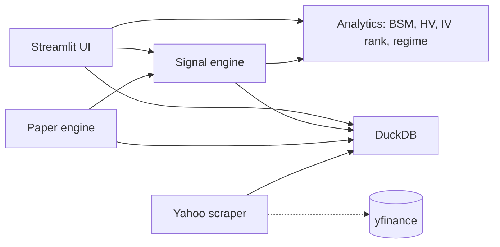

# ◈ VolScope

> ### Is this stock's implied volatility cheap or expensive?
>
> VolScope answers above the fold. Type any ticker and get **one instant
> verdict** on its options — backed by its own Black-Scholes-Merton + IV
> solver (**never** Yahoo's IV), Yang-Zhang realized vol, a volatility
> cone, a time-travelling term structure, regime-shaded IV history, and a
> plain-English read. The volatility screen a retail trader would otherwise
> rent from Bloomberg — self-hosted, in a browser tab.

[](https://github.com/SchoenTom/volscope/actions/workflows/ci.yml)

[](LICENSE)


> [!IMPORTANT]
> **Research / educational software.** VolScope computes and visualises
> volatility — it does not place orders, connect to a broker, or give
> investment advice, and its outputs are not a recommendation. See the
> disclaimer in [`LICENSE`](LICENSE).

## Quick Start

Works on macOS / Linux with Python 3.11+.

```bash
git clone https://github.com/SchoenTom/volscope.git ~/dev/VolScope
cd ~/dev/VolScope
python3 -m venv .venv && source .venv/bin/activate
pip install -r requirements.txt && pip install -e .
cp .env.example .env             # then open .env in your editor — keys are optional for read-only research mode
make quickstart                  # seeds your watchlist (or SPY+QQQ) + launches UI
```

`make quickstart` boots in ~2 min — it seeds your existing
watchlist tickers if you have any, or a 2-ticker baseline of
SPY + QQQ on a fresh DB. You grow the universe interactively from
the sidebar add-ticker form or by pasting a TradingView watchlist
export into **Watchlist → 📥 Import**.

For larger initial seeds:

| Target | Tickers | Time |
|---|---|---|
| `make quickstart` (default) | watchlist tickers, or 2 | ~2 min |
| `make quickstart-bot` | ~75 | ~4 min |
| `make seed-broad` | ~280 | ~10 min |
| `make quickstart-full` | ~842 | ~30-45 min |

Then open <http://localhost:8501>.

## What the UI gives you

- **Scope** — single-ticker deep-dive: IV / HV / skew / 52-w range,
  full term structure, regime status.
- **Discover** — universe-wide ranker over composite edge scores.
- **Heatmap** — sector × IV-percentile treemap.
- **Rotation** — sector rotation signals.
- **Flow** — capital-flow proxy (OI growth, Vol/OI, PCR shift,
  IV-HV divergence, volume clustering).
- **Vol Insights** — skew-adjusted Expected Move, Front/Back IV
  decomposition, OI heatmap with max-pain.
- **Earnings Hub** — weekly grid with implied moves, crowdedness,
  IV-crush calibration.
- **Watchlist** — TradingView-style groupings, per-list alarm
  configuration (Telegram + macOS desktop notifications), live
  spot + 1-day %Δ per ticker.
- **Options Lab** — payoff surface, Greeks surface, scenario
  matrix, time decay, probability cone. BSM-priced, IV-slider
  driven.
- **LEAPS Lab** — convergence scanner (vol mispricing × neglect ×
  reversal) producing deep-OTM LEAPS dossiers.
- **Backtest** — walk-forward strategy simulation with hit-rate,
  Sharpe, max-drawdown per template.
- **Pre-Trade / Builder** — decision-quality checklist + 11
  strategy templates.
- **Portfolio** — paper-trading book with equity curve and
  position-level Greeks.
- **Alerts** — watchlist-scoped or universe-wide threshold trips
  (anomaly, flow, regime, earnings).
- **Help** — glossary + module index.

The analytics layer is shared. Same BSM solver and IV/HV
estimators power Scope, Options Lab, the paper engine, and the
backtest.

## Architecture



Embedded DuckDB; single-operator. Live broker wiring (IBKR) is
explicitly out of scope for the public release — the codebase
contains scaffolds but does not place orders.

## Status

| Phase | State |
|---|---|
| 0 — Stabilise | ✅ DONE |
| 1 — Signal engine | ✅ DONE |
| 2 — Paper engine | ✅ Shipped (real Yahoo chains in / paper book out) |
| 3 — Backtest validation | 🔧 in progress |
| 4+ — Live ramp | ⏳ Out of scope for public release |

See [`memory/roadmaps/`](memory/roadmaps/) for the longer roadmap
documents.

## What this is NOT

- **Not a live trading bot.** No live broker integration. The
  paper engine writes to local DuckDB only.
- **Not financial advice.** Every signal is research output.
- **Not multi-tenant.** Single-user, single-process DuckDB.

## Citations

VolScope's analytics rest on standard literature:

- Hull (2018), *Options, Futures, and Other Derivatives*, 10th ed. —
  Black-Scholes worked examples (validation goldens).
- Yang & Zhang (2000) — drift-independent HV estimator.
- Bali et al. (2008) — Volatility Risk Premium magnitudes.
- López de Prado (2018), *Advances in Financial Machine Learning* —
  CPCV, HMM regime detection.
- tastytrade Market Measures — 21-DTE mechanical close, 50% PT
  benchmarks.

Each load-bearing decision lives in [`docs/adr/`](docs/adr/).

## Contributing

See [`CONTRIBUTING.md`](CONTRIBUTING.md). Conventional Commits, PR
only (no direct main pushes), pre-commit hooks required.

## License

MIT — see [`LICENSE`](LICENSE). Note the research-software /
no-investment-advice clause at the bottom of the LICENSE file.

## For agents

Reading this in a Claude Code session? Start with
[`WELCOME-AGENT.md`](WELCOME-AGENT.md), then
[`CLAUDE.md`](CLAUDE.md), then [`memory/INDEX.md`](memory/INDEX.md).
