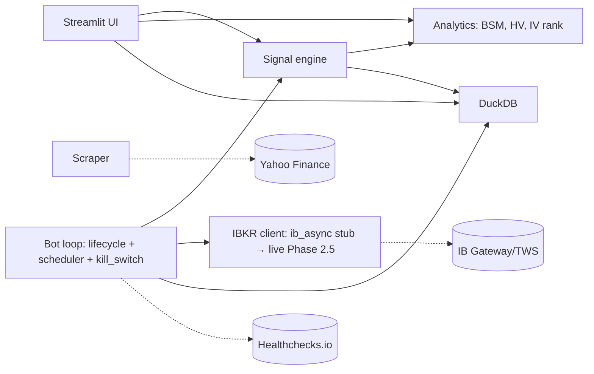

# ◈ VolScope

> **Volatility-research workbench for options traders**, with a
> simulation bot + paper-trading capability layered on top.
>
> The dashboard is the primary product. The bot is one of many users of
> the same analytics engine — it executes the platform's own signals
> against real chain data in simulation, producing measurable rentability.

[](https://github.com/SchoenTom/volscope/actions/workflows/ci.yml)

[](LICENSE)


## Quick Start

```bash
git clone https://github.com/SchoenTom/volscope.git ~/dev/VolScope
cd ~/dev/VolScope
python3 -m venv .venv && source .venv/bin/activate
pip install -r requirements.txt && pip install -e .
cp .env.example .env             # fill in keys before live work
make quickstart                  # seeds your watchlist (or SPY+QQQ) + launches UI
```

`make quickstart` boots in ~2 min — it seeds your existing
watchlist tickers (or a 2-ticker baseline of SPY + QQQ on a fresh
DB). Grow the universe interactively via the sidebar's add-ticker
form or the Watchlist page's CSV import.

For bigger initial seeds:

| Target | Tickers | Time |
|---|---|---|
| `make quickstart` (default) | watchlist or 2 | ~2 min |
| `make quickstart-bot` | ~75 | ~4 min |
| `make seed-broad` | ~280 | ~10 min |
| `make quickstart-full` | ~842 | ~30-45 min |

Open <http://localhost:8501>.

## Three modes, one engine

**1. Research workbench (default).** 17 pages — Scope, Scanner,
Discover, Heatmap, Rotation, Flow, Options Lab, LEAPS Lab, Backtest,
Earnings Hub, etc. — built on a validated Black-Scholes-Merton + IV
analytics layer. Use it like a Bloomberg-for-retail.

**2. Simulation bot.** The same analytics produce ranked trade
signals. The paper engine executes them against real Yahoo
option-chain data (full strike × expiry grid), applies a realistic
slippage model, and tracks lifecycle with a 50% PT / 2× stop /
21-DTE-mechanical-close discipline. Result: a measurable Sharpe / win
rate / max-DD per strategy, not gut-feel.

**3. Paper trader (manual).** Multi-leg buy/close with a virtual
cash account. Use it to validate your own thesis with a
1:1 broker simulation — no bot involved.

> **Live IBKR orders are NOT in scope.** The platform is designed for
> research and simulation. Going live requires explicit operator
> opt-in + paper-validation of 100+ closed trades — see
> `docs/roadmap/phase-overview.md`.

## What VolScope does today

- **IV analysis** — own Black-Scholes-Merton solver (price + 5 Greeks),
  Newton-Raphson IV solver validated against `py_vollib` to 1e-15.
- **Four HV estimators** — close-to-close, Parkinson, Garman-Klass,
  Yang-Zhang.
- **IV rank / percentile / regime** + IV-HV spread analytics.
- **Bidirectional signal engine** — composite-score ranker over
  IVR / IVP / IV-HV / term-slope / 25Δ-RR / HV-momentum / HMM regime.
- **Bot Dashboard** (read-only) — portfolio Greeks, regime gauge,
  ranked signals, open trades, equity curve.
- **Options Lab** — payoff diagrams, Greeks surface, scenario matrix,
  time decay, 11 strategy templates.
- **LEAPS Lab v3** — convergence scanner with deep-OTM dossier renderer.
- **Paper engine** (Phase 2 — v0.3.0): real Yahoo chain data ingested into
  `bot_chain_snapshots`; `paper_engine.py` executes ranked signals
  against the latest snapshot; `daily_mtm.py` enforces 50%-PT /
  2×-stop / 21-DTE-close exits; closed trades feed a Sharpe / win-rate /
  max-DD report on the Bot Dashboard.
- **Bot infrastructure scaffolds** (Phase 2 core): 11-state lifecycle
  machine, APScheduler with America/New_York timezone, kill switch
  with 3 manual + 5 auto trip paths, preflight check, reconciliation
  stub.

**For a complete tool catalog** — every page, every analytics module,
every script + how they chain together — see
[`docs/TOOLS.md`](docs/TOOLS.md).

## Quick start

Works on any Mac / Linux with Python 3.11+ pre-installed. Pick ONE
path — they're equivalent:

**Path A — pip (always works):**

```bash
git clone https://github.com/SchoenTom/volscope.git && cd volscope
python3 -m venv .venv
source .venv/bin/activate
pip install -r requirements.txt
pip install -e .                       # makes "import volscope" work everywhere
cp .env.example .env                   # then open .env and fill in keys
make quickstart                        # seeds 8 tickers + launches Streamlit
```

**Path B — uv (faster, requires uv installed):**

```bash
# Install uv first: curl -LsSf https://astral.sh/uv/install.sh | sh
git clone https://github.com/SchoenTom/volscope.git && cd volscope
uv sync --all-extras
uv pip install -e .
cp .env.example .env                   # then open .env and fill in keys
uv run pre-commit install
make quickstart
```

Then open **http://localhost:8501**.

**Downloading the repo as a ZIP from GitHub?** Same as Path A, but
skip the `git clone` line (you already have the unpacked folder).
`cd` into it before the `python3 -m venv` step.

**Note on the `.env` step:** the line is `cp .env.example .env` — the
`# fill in keys` is just a comment for the README; do not type it.
After the copy succeeds, open `.env` in your editor and fill in the
keys (or leave them blank for read-only research mode).

## Architecture



See [`docs/ARCHITECTURE.md`](docs/ARCHITECTURE.md) for the full module
map + data flow + WORM audit-log invariant.

## Status

| Phase | State |
|---|---|
| 0 — Stabilise | ✅ DONE |
| 1 — Signal engine | ✅ DONE |
| 2 — Paper loop | 🔧 SCAFFOLD shipped, live wiring planned |
| 3 — Backtest validation | ⏳ Planned |
| 4 — Go-live ramp | ⏳ Planned |
| 5+ — Advanced | ⏳ Future |

See [`ROADMAP.md`](ROADMAP.md) for the full phase table and exit gates.

## What this is NOT

- **Not a live trading bot today.** Phase 2 ships scaffolds; live IBKR
  orders require Phase 2.5 paper validation + explicit operator
  approval.
- **Not financial advice.** Every signal is research output. The
  operator is responsible for trade decisions.
- **Not multi-tenant.** Single-operator embedded DuckDB.

## Citations

VolScope's design rests on the following research:

- Castillo & Mira-McWilliams (2026). *FinTech* 5(1), 26 — IV
  mean-reversion universe.
- López de Prado (2018). *Advances in Financial Machine Learning* —
  CPCV, HMM regime detection.
- tastytrade Market Measures — 21-DTE mechanical close (gamma study),
  50% PT (4,872 SPY trades, 2005-2019).
- Bali et al. (2008) — Volatility Risk Premium magnitudes.
- Hull (2018). *Options, Futures, and Other Derivatives*, 10th ed. —
  Black-Scholes worked examples (validation goldens).
- Yang & Zhang (2000) — drift-independent HV estimator.

Each load-bearing decision has an ADR in [`docs/adr/`](docs/adr/).

## Contributing

See [`CONTRIBUTING.md`](CONTRIBUTING.md). TL;DR: Conventional Commits,
PRs only (no direct main pushes), pre-commit hooks required, 65%
coverage gate.

## Security

See [`SECURITY.md`](SECURITY.md). Vulnerability reports → repo owner
directly (no public issue).

## License

Proprietary — see [`NOTICE`](NOTICE). Will flip to MIT when
[`docs/GOING_PUBLIC_CHECKLIST.md`](docs/GOING_PUBLIC_CHECKLIST.md)
gates clear.

## For agents

Reading this in a Claude Code session? Start with
[`WELCOME-AGENT.md`](WELCOME-AGENT.md), then
[`CLAUDE.md`](CLAUDE.md), then
[`memory/INDEX.md`](memory/INDEX.md).
