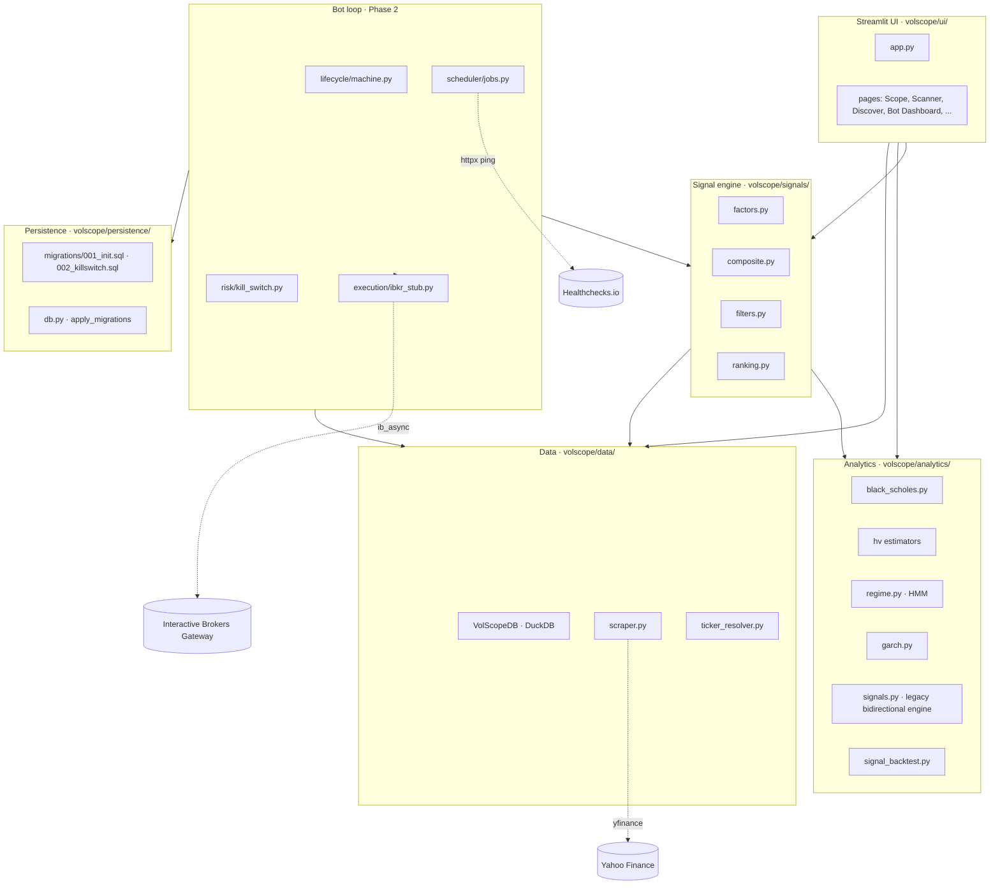

# Architecture

VolScope is a single-tenant Python application that does three jobs from
one DuckDB file:

1. **Research dashboard** — Streamlit UI for IV analysis, scanning,
   strategy building, LEAPS dossier rendering.
2. **Signal engine** — bidirectional IV mean-reversion scanner emitting
   ranked trade candidates.
3. **Autonomous bot** (Phase 2 scaffold) — Interactive Brokers paper /
   live engine driven by an APScheduler loop and a kill-switch
   risk layer.

## Module map

## Data flow — daily cycle (when the bot is running)

1. **08:00 ET — `premarket_load`**: scrape EOD chains for yesterday, hydrate
   `daily_vol`, `chain_snapshots`.
2. **08:30 — `connect_ibkr`**: ib_async client connects to the configured
   Gateway/TWS port; sets up event handlers + watchdog (Phase 2.5).
3. **09:45 — `generate_signals`**: factors → composite → run_all_gates →
   rank_signals; output written to `bot_signals_log`.
4. **10:00 — `execute_entries`**: ranked signals with `decision=EXECUTE`
   become `TradeLifecycle` instances; state machine moves them through
   SIGNALED → SIZED → SUBMITTED → FILLED → MANAGED.
5. **12:00 — `midday_check`**: re-evaluate open trades; close at 50% PT,
   stop at 2× credit, or 21-DTE mechanical close.
6. **15:00 — `eod_management`**: same checks; flag tomorrow's expiries.
7. **16:15 — `eod_reconcile`**: compare DuckDB `bot_trades` vs
   IBKR `reqAllOpenPositions()`; emit `bot_orders_log` deltas.
8. **Every 5 min — `heartbeat`**: HTTP ping to `HEALTHCHECKS_URL` if set.

## Database — table inventory

VolScope writes to a single DuckDB at `~/Library/Application Support/VolScope/volscope.db`.

| Table | Purpose |
|---|---|
| `daily_vol` | Per-ticker per-day OHLCV + IV30, HV (CC/Park/GK/YZ), IV rank, IV percentile, IV/HV ratio, sector, company_name. |
| `chain_snapshots` | EOD option chain mid + bid/ask per strike, per expiry, per ticker. |
| `sector_history` | Daily sector aggregates for the Rotation page. |
| `earnings_calendar` | Confirmed + estimated earnings dates, BMO/AMC flag, source confidence. |
| `signal_log` | Legacy bidirectional signal capture (research). |
| `bot_trades` | One row per logical bot trade (multi-leg combo is one row). State-machine state lives here. |
| `bot_legs` | Per-leg detail of each bot trade (FK to `bot_trades`). |
| `bot_pnl_daily` | Daily NLV / Greek / P&L roll-up. |
| `bot_signals_log` | Every signal the engine emits, traded or not. |
| `bot_orders_log` | Every order request + fill received from IBKR. |
| `bot_killswitch` | Single-row table with the active kill state. |
| `bot_migrations` | Versioned migration bookkeeping. |

## WORM audit log — invariant

`bot_signals_log`, `bot_orders_log`, and `bot_killswitch.tripped_at`
rows are **write-once-read-many**. No code path is allowed to UPDATE or
DELETE these rows. This matters for:

- **Tax filing** — Anlage KAP requires a complete trade record with
  immutable timestamps.
- **Dispute defence** — if IBKR claims a trade never happened, we have
  the local audit row with the exact `orderRef` we sent.
- **Post-mortem analysis** — after a drawdown, we need to be sure no
  one (human or agent) "tidied up" the logs.

Enforcement: tests in `tests/test_audit_worm.py` (Phase 2.5) assert
that no `UPDATE` or `DELETE` statement appears in any code path that
touches these three tables.

## Tech-stack pins (verified 2026-05)

See [`/pyproject.toml`](../pyproject.toml). Key decisions are recorded
in `docs/adr/`:

- `0002` — DuckDB over Postgres for retail single-tenant.
- `0003` — `ib_async` (not archived `ib_insync`).
- `0004` — Quarter-Kelly position sizing.
- `0005` — 21-DTE mechanical close for short-vol trades.
